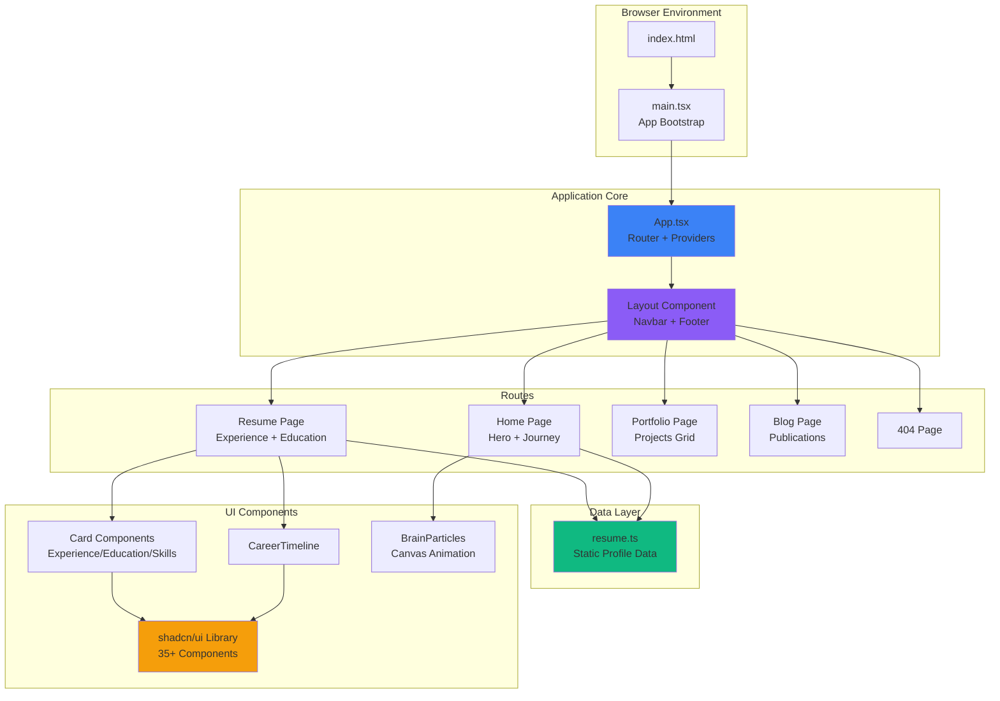

# Architecture Overview - Portfolio Curriculum

**Project**: Gabriel Ortega Hernández Portfolio & CV Web Application  
**Tech Stack**: React 19 + TypeScript + Vite + shadcn/ui + Tailwind CSS  
**Status**: Production-ready SPA  
**Last Updated**: February 3, 2026

---

## Executive Summary

This is a **Single Page Application (SPA)** portfolio website showcasing Gabriel Ortega Hernández's professional profile, experience, and research work. The application is built with modern frontend technologies emphasizing performance, accessibility, and visual appeal through animated UI components.

**Primary Use Cases**:
- Professional profile presentation
- Resume/CV display with interactive timeline
- Portfolio showcase with interactive demonstrations
- Publications and research listing

**Key Characteristics**:
- Client-side only (no backend/API integration)
- Static data from TypeScript modules
- Component-based architecture with shadcn/ui
- Responsive design with dark theme
- Animation-heavy UX with Framer Motion

---

## High-Level Architecture



---

## System Components

### 1. Entry Point & Bootstrap

**File**: [main.tsx](../workspace/shadcn-ui/src/main.tsx)

**Purpose**: Application initialization and DOM mounting.

**Contract**:
- **Input**: None (browser load)
- **Output**: Renders React tree into `#root` element
- **Dependencies**: React 19, ReactDOM

**Behavior**:
```typescript
createRoot(document.getElementById('root')!).render(<App />);
```

---

### 2. Application Root

**File**: [App.tsx](../workspace/shadcn-ui/src/App.tsx)

**Purpose**: Configure global providers, routing, and UI infrastructure.

**Contract**:
- **Providers**:
  - `QueryClientProvider` - TanStack Query for data fetching (currently unused)
  - `TooltipProvider` - shadcn tooltip context
  - `Toaster` - Toast notification system (sonner)
  - `BrowserRouter` - React Router v6 navigation

**Routes**:
| Path | Component | Purpose |
|------|-----------|---------|
| `/` | `Home` | Landing page with hero and journey scroll |
| `/resume` | `Resume` | Professional experience and education |
| `/portfolio` | `Portfolio` | Project showcases and demos |
| `/blog` | `Blog` | Publications list |
| `*` | `NotFound` | 404 error page |

**Failure Modes**: 
- **No error boundaries defined** - Component errors will crash entire app (TBD)

---

### 3. Layout & Navigation

**File**: [Layout.tsx](../workspace/shadcn-ui/src/components/Layout.tsx)

**Purpose**: Persistent layout wrapper with navigation and footer.

**Structure**:
```
┌─────────────────────────┐
│      <Navbar />         │  ← Navigation header
├─────────────────────────┤
│                         │
│     <Outlet />          │  ← Page content (from router)
│                         │
├─────────────────────────┤
│      <footer />         │  ← Copyright info
└─────────────────────────┘
```

**Behavior**:
- Dark theme (`bg-zinc-950`)
- Responsive container (`max-w-7xl`)
- Fade-in animation on route change

---

## Data Architecture

### Static Resume Data

**File**: [resume.ts](../workspace/shadcn-ui/src/data/resume.ts)

**Schema**:
```typescript
{
  profile: {
    name: string
    title: string
    email: string
    phone: string
    location: string
    about: string
    avatar: string  // Path to image
  }
  experience: Array<{
    company: string
    role: string
    period: string
    description: string
  }>
  education: Array<{
    institution: string
    degree: string
    period: string
    thesis?: string
  }>
  skills: {
    languages: string[]
    web: string[]
    data_ml: string[]
    tools: string[]
  }
  publications: Array<{
    title: string
    journal: string
    year: string
    authors: string
  }>
}
```

**Access Pattern**: Direct ES6 import in page components  
**Update Mechanism**: Manual code edit + rebuild  
**No external API** - all data is compiled into bundle

---

## Page Components

### Home Page

**File**: [Home.tsx](../workspace/shadcn-ui/src/pages/Home.tsx)

**Sections**:
1. **Hero Section** (70vh)
   - Name + tagline
   - CTA buttons → Portfolio, Resume
   - Grid background effect

2. **Journey Section** (Scrollytelling)
   - Uses `StickyScroll` component
   - 3 content blocks:
     - Mathematical Engineering Foundation
     - Impact in Education
     - Research in Cognition & AI
   - Includes `BrainParticles` canvas animation

3. **CTA Section**
   - Footer call-to-action

**Animations**: Framer Motion (fade-in, slide-up)

---

### Resume Page

**File**: [Resume.tsx](../workspace/shadcn-ui/src/pages/Resume.tsx)

**Sections**:
1. **Header** - Title + "Download PDF" button (functionality TBD)
2. **Professional Experience**
   - `CareerTimeline` visualization
   - List of `ExperienceCard` components (10 entries)
3. **Education**
   - List of `EducationCard` components (3 entries)
4. **Skills**
   - `SkillsCard` component with categorized tech stack

**Data Source**: `resumeData` from [resume.ts](../workspace/shadcn-ui/src/data/resume.ts)

**Known Gaps**:
- PDF download button is non-functional (TBD)

---

### Portfolio Page

**File**: [Portfolio.tsx](../workspace/shadcn-ui/src/pages/Portfolio.tsx)

**Layout**: Bento Grid (asymmetric grid layout)

**Items**:
1. **Interactive Demo** (2x2 grid span) - Main showcase
2. **Item Difficulty Prediction** (1x1) - Project card with icon
3. **Eye-Tracking Analysis** (1x1) - Project card with icon

**Note**: Project cards are placeholder content; interactivity TBD

---

### Blog Page

**File**: [Blog.tsx](../workspace/shadcn-ui/src/pages/Blog.tsx)

**Content**: Single bento grid item with `PublicationsCard`

**Purpose**: Display academic research publications from `resumeData.publications`

---

## UI Component Library

### shadcn/ui Components

**Location**: [src/components/ui/](../workspace/shadcn-ui/src/components/ui/)

**Count**: 35+ pre-built components

**Key Components Used**:
- `Button` - Primary UI actions
- `Card` - Content containers
- `Tabs`, `Accordion` - Content organization
- `Toast` (Sonner) - Notifications
- `BentoGrid` - Portfolio layout
- `StickyScroll` - Scrollytelling effect

**Customization**: Via Tailwind CSS classes and CVA (Class Variance Authority)

---

### Custom Components

#### BrainParticles

**File**: [BrainParticles.tsx](../workspace/shadcn-ui/src/components/BrainParticles.tsx)

**Purpose**: Animated particle network visualization using HTML5 Canvas

**Behavior**:
- 60 particles with physics simulation
- Particles connected within 100px distance
- Mouse interaction: attraction force within 150px
- Color scheme: Violet (#8b5cf6)

**Performance**: RequestAnimationFrame loop, no throttling

**Use Case**: Visual enhancement in Home page "Journey" section

---

#### CareerTimeline

**File**: [CareerTimeline.tsx](../workspace/shadcn-ui/src/components/CareerTimeline.tsx)

**Purpose**: Visual timeline of professional experience

**Data Source**: `resumeData.experience`

**Rendering**: (TBD - component content not fully examined)

---

#### ExperienceCard / EducationCard / SkillsCard

**Purpose**: Formatted display cards for resume data

**Contract**:
- **Input**: Props matching resume data schema
- **Output**: Styled card with shadcn/ui components
- **Styling**: Dark theme, consistent spacing

---

## Build & Development

### Configuration

**Build Tool**: Vite 5.4.1  
**Package Manager**: pnpm 8.10.0  
**TypeScript**: 5.5.3  
**Target**: ES2020, Modern browsers

**Vite Config** ([vite.config.ts](../workspace/shadcn-ui/vite.config.ts)):
- React SWC plugin (fast refresh)
- Path alias: `@` → `./src`
- Source locator plugin (MetaGPTX)
- Dev server: Polling mode enabled (800ms interval)

### Scripts

| Command | Purpose |
|---------|---------|
| `pnpm dev` | Start dev server (default port 5173) |
| `pnpm build` | Production build → `dist/` |
| `pnpm preview` | Preview production build |
| `pnpm lint` | ESLint check (quiet mode) |

### Dependencies Summary

**Core**:
- React 19.1.1 + React DOM
- React Router DOM 6.26.2
- TanStack Query 5.56.2 (installed but unused)

**UI**:
- 20+ Radix UI primitives (@radix-ui/react-*)
- Framer Motion 11.18.2
- Lucide React 0.462.0 (icons)
- Sonner 1.5.0 (toasts)

**Forms & Validation**:
- React Hook Form 7.53.0
- Zod 3.23.8

**Styling**:
- Tailwind CSS 3.4.11 + plugins
- Class Variance Authority 0.7.1

**Other**:
- Supabase JS 2.50.3 (installed but not used - TBD)
- Zustand 4.5.0 (state management - not observed in code)

---

## Deployment & Hosting

**Build Output**: Static files in `dist/`

**Deployment Strategy**: (TBD)
- No CI/CD configuration found
- No environment variables observed
- No API endpoints to configure

**Expected Hosting**: Static hosting (Vercel, Netlify, GitHub Pages, etc.)

---

## Security & Performance

### Security Posture

- **No authentication/authorization** - Public portfolio site
- **No user input** - Read-only content
- **No external API calls** - Self-contained
- **XSS Risk**: Minimal (no dangerouslySetInnerHTML observed)

**Dependency Vulnerabilities**: (TBD - npm audit not run)

---

### Performance Characteristics

**Bundle Size**: (TBD - build not analyzed)

**Optimization Strategies**:
- SWC compiler (faster than Babel)
- Tree-shaking via Vite
- Code splitting via React.lazy (not currently used - TBD)

**Potential Improvements**:
- Lazy load route components
- Optimize BrainParticles canvas rendering
- Image optimization (avatar, project images)
- Preload critical fonts

---

## Testing Strategy

**Current State**: No test files found in codebase

**Recommended Coverage**:
- Unit tests: Data transformations, utility functions
- Component tests: Card rendering, navigation
- Integration tests: Route transitions, data display
- E2E tests: User journeys (view resume, navigate portfolio)

**Frameworks** (TBD): Vitest, React Testing Library, Playwright

---

## Accessibility (A11y)

**Current Measures**:
- Semantic HTML structure
- Dark theme with sufficient contrast (TBD - needs audit)
- Keyboard navigation via shadcn/ui (Radix primitives)

**Gaps** (TBD):
- No ARIA labels on canvas animation
- Focus indicators not verified
- Screen reader testing not conducted
- Color contrast ratios not measured

---

## Failure Modes & Error Handling

### Identified Failure Scenarios

1. **Component Rendering Errors**
   - **Current**: No error boundaries
   - **Impact**: Entire app crashes
   - **Mitigation**: (TBD) Add React Error Boundary

2. **Route Not Found**
   - **Handling**: `NotFound` component renders
   - **Impact**: User sees 404 page

3. **Data Missing/Malformed**
   - **Risk**: If `resumeData` is incomplete
   - **Handling**: None (will throw runtime error)
   - **Mitigation**: (TBD) Add schema validation

4. **Canvas Rendering Failure**
   - **Component**: `BrainParticles`
   - **Handling**: Silent failure (returns null if no canvas)
   - **Impact**: Section appears empty

5. **Asset Loading Failure**
   - **Risk**: Profile image, fonts fail to load
   - **Handling**: Browser default alt text
   - **Mitigation**: (TBD) Add fallback UI

---

## Integration Points

### External Services

**Supabase**: 
- Client library installed but not initialized
- **Status**: TBD
- **Potential Use**: Blog CMS, analytics, authentication

**TanStack Query**:
- Configured but no queries defined
- **Status**: Prepared for future API integration

**No Analytics**: Google Analytics, Posthog, etc. not observed (TBD)

---

## Information Requested

The following details are needed to complete the architectural documentation:

1. **Deployment**:
   - Target hosting platform?
   - Custom domain configured?
   - CI/CD pipeline in place?
   - Build output size targets?

2. **Functionality Gaps**:
   - PDF download implementation plan?
   - Interactive demo content?
   - Portfolio project details/links?
   - Blog/Publications: Static only or CMS integration planned?

3. **Supabase Usage**:
   - Is Supabase intended for future use?
   - Authentication needed?
   - Database schema if applicable?

4. **State Management**:
   - Zustand installed but not used - planned features?
   - Form state needed beyond resume display?

5. **Testing**:
   - Testing strategy/framework preference?
   - Coverage targets?

6. **Performance**:
   - Target bundle size?
   - Lighthouse score goals?
   - Browser support matrix?

7. **Accessibility**:
   - WCAG compliance level target (A, AA, AAA)?
   - Screen reader testing planned?

8. **Analytics & Monitoring**:
   - Analytics provider?
   - Error tracking (Sentry, Rollbar)?
   - Performance monitoring?

9. **Content Management**:
   - How will resume data be updated?
   - Publication list maintenance process?
   - Is a headless CMS integration planned?

10. **Security**:
    - Dependency audit schedule?
    - CSP (Content Security Policy) requirements?

---

<small>Generated with GitHub Copilot as directed by Gabriel Ortega Hernández</small>
